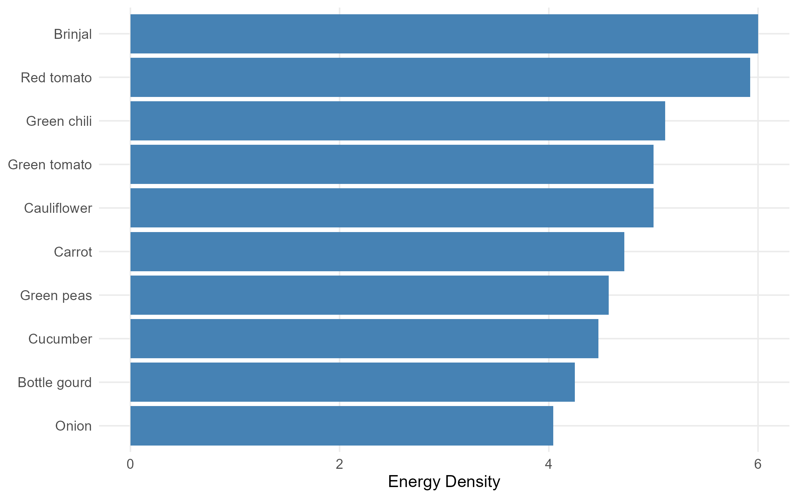
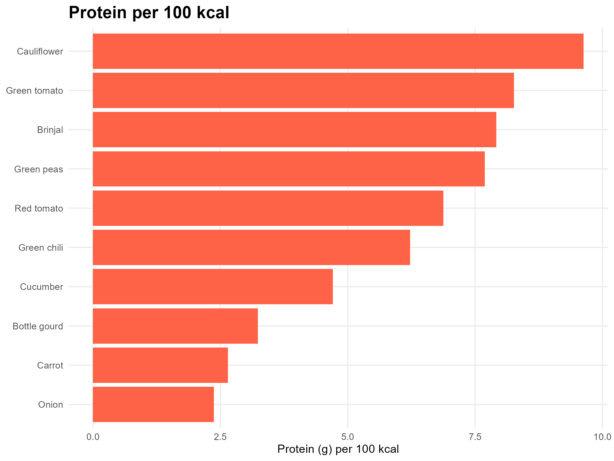

# 🥦 Nutrient Density Analysis of 10 Vegetables

This project explores the **nutrient density** of 10 common vegetables using R programming. It calculates and visualizes energy and protein density per 100 kcal based on Food Composition Table (FCT) data.

---

## 📌 Purpose

The goal of this project is to:
- Compare different vegetables based on their nutrient content per 100 kcal.
- Identify top energy-dense and protein-dense options for affordable and nutritious diets.
- Demonstrate data wrangling and visualization skills in R.

---

## 📂 Dataset

- **Source:** Manually curated dataset from Bangladesh Food Composition Table (FCT), [Available here](https://www.researchgate.net/publication/268520007_Food_Composition_Table_for_Bangladesh)
- **File Used:** `Nutrients.xlsx`
- **Fields Included:**
  - Food Name  
  - Energy (kcal)  
  - Protein (g)  
  - Other nutrients (fat, vitamins, minerals)

---

## ⚙️ Tools & Packages Used

- `ggplot2` – for plotting bar graphs  
- `readxl` – to read Excel data  
- `dplyr` – for data cleaning and transformation  
- `mutate()` – to calculate nutrient scores  
- `ggsave()` – for saving plots

---

## 📈 Outputs

### 🔹 Energy-Dense Vegetables  

Ranks vegetables by kcal per 100g.

---

### 🔹 Protein per 100 kcal 

Highlights protein-rich vegetables relative to calorie content.

---

## 🧠 Key Insights
- Such visualizations can inform **healthy food selection** for diet planning, especially in cost-sensitive contexts.

---

## ▶️ How to Reproduce

1. Clone this repository  
2. Install required R packages: `readxl`, `dplyr`, `ggplot2`  
3. Open and run the scripts:
   - `Energy_density.R` – for energy density analysis
   - `Protein_per_100_kcal.R` – for protein density analysis  
4. Output images will be saved to the project folder

---

---

## 👩‍💻 Author

**Afsana Ashrafi**  
Graduate Researcher – Nutrition and Food Science  
📧 afsanaashrafi41@gmail.com  
🔗 [LinkedIn](https://www.linkedin.com/in/afsana-ashrafi-a3475119a/) | [GitHub](https://github.com/ashrafi-bd)

---

## 📘 License

This repository is for academic and public health awareness purposes only. Data originates from publicly available Food Composition Tables.

